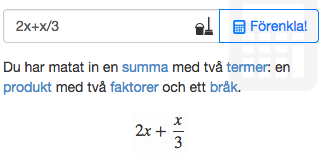
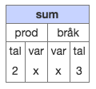
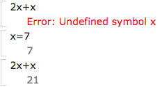
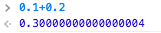
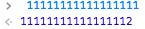

### Rita ut matematik

Vi måste kunna rita ut matematiska uttryck på skärmen. Ni använder redan [MathJax](http://mathjax.com), vilket jag är tämligen övertygad om är den bästa lösningen. Den stödjer både MathML och LaTeX (som både in- och utdata), vilket gör den kompatibel med så gott som alla andra bibliotek man skulle kunna tänkas vilja blanda in.

Nackdelen är möjligen att MathJax-paketet är ganska stort, men jag tror inte man ska fästa alltför stor vikt vid det. Jag använder själv MathJax i mobillösningen för [Algebra Explorer](http://www.algebraexplorer.com) och har inte upplevt att dess vikt är ett problem.

Ett möjligt alternativ skulle vara att använda MathQuill för att rita ut matematiken, frestande om man ändå använder MathQuill för sin editor. Den är dock inte lika fullfjädrad som MathJax, och MathQuill rekommenderar själva MathJax.


### Indata från användaren

Ett delikat problem! Här finns det många vägar att gå, och vilken väg man väljer påverkas mycket av vad nyttjade bibliotek nedströms vill ha. MathQuill är dock den överlägset största spelaren. Används av E-Math, Desmos, Mathspace, etc. Dessutom gediget byggt under motorhuven (jag har varit där och [rotat lite](https://github.com/mathquill/mathquill/pull/191)). 

Notera att det inte är självklart att ha ett gränssnitt där vi hanterar bråk, potenser etc redan i inmatningsfältet. Exempelvis valde jag i Algebra Explorer att ha en lösning där användaren skriver ren text, men får i realtid en rendering och en beskrivning av uttrycket:



Detta kombinerar jag med att också exponera uttryckets trädstruktur via en närbildsfunktion.



Erfarenheten hittills är dock att det är få elever som har glädje av denna abstrakta gestaltning.

Trädstrukturen berör ett av de stora nedströmsproblemen; om vi inte bara vill rita ut det som skrevs in utan på något sätt behandla uttrycket - förenkla, rita ut, etc - då MÅSTE vi någonstans ha ett dataträd över de ingående noderna i uttrycket. Detta behöver nödvändigtvis inte ligga i inmatningsdelen; den skulle kunna spotta ur sig LaTeX eller dylikt, som nästa bibliotek sedan trädtolkar. NÅGON måste göra det jobbet. 

Här är en litet demo där jag lyft ut min hemmabyggda tolkare:

<iframe width=600 height=250 src='tolk/index.html'></iframe>

Som synes spottar den ur sig ett egetpåhittat format där varje objekt har ett `type`-attribut, eventuella barn finns listade under `objs`, och lövens värde finns i `val`. 

Man ser också värdena `used` och `rest`, som är arbetsvariabler när texten skall tolkas.

Denna datastruktur är vad min interna CAS-motor använder. När resultatet sedan skall renderas på skärmen så har jag en omvandlare från denna struktur till MathML.


### Desmos

Desmos har ett [öppet API](https://www.desmos.com/api/v0.4/docs/) avsett just för att integrera det i en befintlig lösning. Det är byggd för att ladda från deras server med en API-nyckel, men det är ganska lätt att tjuvkoppla den för att testa runt lokalt (som jag gjort här).

<iframe width=800 height=450 src='desmos/calc2.html'></iframe>

Förutsatt att vårt html-dokument innehåller följande element...

```html
<div id="calculator" style="width: 800px; height: 400px;"></div>
```

...så kan vi instantiera en räknare genom följande triviala kod:

```javascript
var calculator = Desmos.Calculator(document.getElementById('calculator'));
```

Det skapade objektet kan sedan interageras med för att koppla räknaren med kontextuell funktionalitet, precis som vi gjorde med de exporterade Geogebra-labbarna häromåret. Desmos exponerar nuvarande status i räknaren via `calculator.getState`. 

Prova att skriva in några olika uttryck i desmosräknaren ovan och tryck sedan på knappen "visa LaTeX" under. Den funktionaliteten implementerade jag genom att loopa igenom den exponerade datan (som finns i `getstateresult.expressions.list`):

```javascript
document.getElementById("latexbutton").addEventListener("click",function(e){
  alert(_.reduce(calculator.getState().expressions.list,function(str,o,n){
    return str + (n+1) + ": " + o.latex + "\n";
  },""));
});
```

På dylikt manér kan man implementera en historik, delningsfunktionalitet och koppling mot plattformen i övrigt.

Flöden åt andra hållet implementeras via `calculator.setExpression`. För att demonstrera detta skapade jag den andra knappen, som lägger till ett bråk i listan genom följande kod:

```javascript
document.getElementById("fracbutton").addEventListener("click",function(e){
  calculator.setExpression({
    id: Math.random(),
    latex: "\\frac{"+(Math.floor(Math.random()*10))+"}{"+(2+Math.floor(Math.random()*10))+"}"
  });
});
```

### Math 42

De som bygger appen [Math 42](http://math-42.com/) jobbar också på ett webbgränssnitt med samma funktionalitet. Tyvärr har jag skrivit på ett NDA så jag kan inte visa, men funktionaliteten motsvarar [appens](http://math-42.com/features/); smart inmatning, CAS och grafer. Sist jag pratade med dem så var fokus på att bygga en egen webbtjänst och inte att erbjuda ett bibliotek, men de sneglade även åt det hållet.

Så potentiellt en bra danspartner! Jag hade lite kontakt med dem senast i somras i samband med att jag färdigställde Algebra Explorer, som ju ligger ganska nära deras lösning. 

### Math Notepad

Ett projekt som jag sneglat lite på är [Math Notepad](http://mathnotepad.com/), som är ett grafiskt gränssnitt byggt på [Math.js](http://mathjs.org/). De använder inga hjälpmedel för vare sig indata eller rendering av matematik; användaren matar in "ren" text.

Den har CAS-funktionalitet under motorhuven; om du matar in "i+2i" så förenklar den till "3i". Tyvärr har de inte haft vett att exponera denna funktionalitet för variabler, så om du provar "x+2x" så protesterar den. Om du innan har definierat att "x=7", så utvärderar den istället "x+2x" till 21.



Eftersom funktionaliteten finns under motorhuven så skulle det förmodligen gå att tillgängliggöra denna för variabler om man verkligen ville, men vid ett första ögonkast på koden så känns det inte helt trivialt.

Projektet har annars en viss elegans, och det integrerande grafplottandet är snyggt! Men gränssnittet bygger på att man skriver in funktioner och matematik utan stöd, vilket förmodligen är en dealbreaker. 

Testa funktionaliteten i math.js-biblioteket i demoappen nedan:

<iframe src="math/index.html" height=300 width=800></iframe>


### Symbolab

Möjligen skulle [Symbolab](https://www.symbolab.com/) kunna vara intressanta att prata med. De har MathQuillinmatning, CAS-motor med förenkling steg för steg, samt grafritande. Med andra ord ligger de nära det du visualiserar.

Å andra sidan så anropar de sin server för varje beräkning (i samma stil som Wolfram Alpha), och idealet vore ju en lösning som kan bo helt på klientsidan och därmed fungera offline (och på mobila enheter).


### Geogebra Web

Det är också frestande att göra som [skoledu.dk](skoledu.dk) och dina tyska vänner, och köra på en fullödig Geogebra-lösning. Precis som de förmodligen berättade så är det dock ett antal klyftor att överbrygga, framför allt om du vill använda den som räknar- och CAS-motor. Funktionaliteten finns där, men är inte avsedd att exponeras på det sättet.

Är den investeringen väl gjord så skulle dock lösningen kunna bli mer eller mindre självförsörjande. Det vore intressant att titta närmare på skoledu.dk!


### JavaScript CAS

Letar man efter JavaScript-lösningar för CAS (vilket det finns förvånansvärt lite av) så kommer man snubbla över [JavaScript](https://github.com/aantthony/javascript-cas). Omfattande funktionalitet, men övergivet sedan några år, och inte så förtroendeingivande när man tjuvkikar på kod. Rekommenderas ej.


### Grundläggande aritmetik i JavaScript

Om ni väljer att själva implementera den grundläggande aritmetikdelen av räknaren (vilket inte rekommenderas), så måste hänsyn tas till JavaScripts gestaltning av tal. Denna innebär att vissa aritmetiska operationer inte blir korrekta. Decimala operationer är inte pålitliga:



Även för större heltal så uppstår "tysta fel", där JavaScript utan att protestera förvränger indatan:



Det vedertagna namnet för bibliotek som hanterar detta är "Big Number" (även om de hanterar decimaltal också), och en sökning på detta i NPM ger [en uppsjö av resultat](https://www.npmjs.com/search?q=big+number). Samtliga med många nedladdningar är pålitliga, jag valde i slutändan [BN](https://www.npmjs.com/package/bn.js) för Algebra Explorer.

### Kardemummasumman

Även om vi inte ens börjat få mer fastare konturer kring slutresultatet så kan några iakttagelser göras:

*    Sannolikt är det lämpligt att använda MathQuill som indatahantering, antingen fristående eller som en del av en tyngre lösning som Desmos
*    Motorn som skall förenkla och CAS:a bör därmed klara av att ta emot LaTeX.
*    Därmed blir det lämpligt att också motorn också spottar ut LaTeX i andra änden för utritning, då MathJax stödjer detta. Notera dock att oavsett lösning så görs någon sorts omvandling till ett annat format inne i mattemotorn, så det behöver inte bli något merarbete att istället få ut exempelvis MathML istället, eftersom en omvandling alltid äger rum. MathML har fördelen att den kan [ritas natively i vissa webbläsare](http://caniuse.com/#feat=mathml) (inklusive Safari iOS, vilket fick mig att välja det till Algebra Explorer).

### Filosoferande

Jag har haft ytterligare några sittningar med kärntruppen av IKT:iga mattelärare i gänget apropå din frågeställning om vad man egentligen vill. Vilket är sjukt svårt! Jag har fortfarande inga bra svar. Det känns långt ifrån självklart att det för mig som konsument är smidigast att ha en helhetslösning i läromedlet, utan snarare vill jag kunna sätta ihop min egen verktygslåda. Samtidigt är det såklart frestande från producenthåll att erbjuda en helhetslösning. Knepigt!